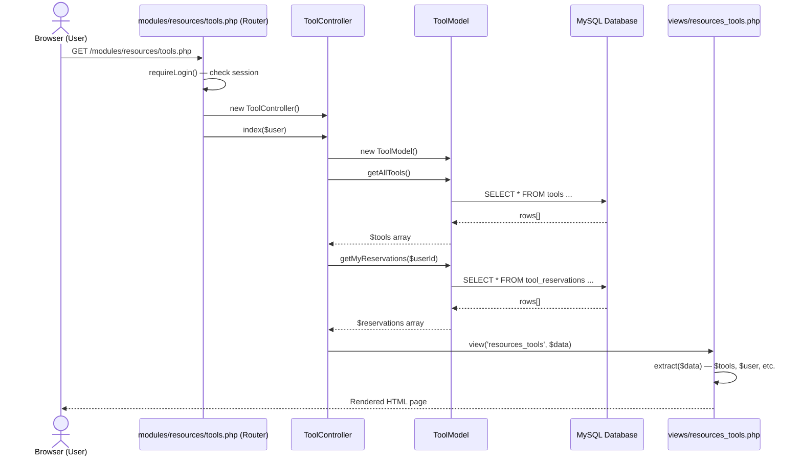
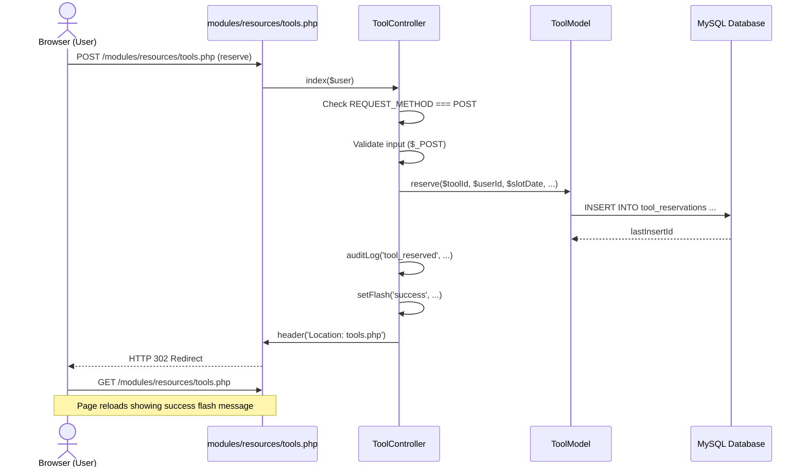

# Community Garden Management System
## Comprehensive Diagram Reference

This file contains all the information and Mermaid code needed to produce:
1. [Class Diagram](#1-class-diagram)
2. [Entity-Relationship (ER) Diagram](#2-entity-relationship-er-diagram)
3. [Use Case Diagram](#3-use-case-diagram)
4. [Sequence Diagram](#4-sequence-diagram--request-lifecycle)
5. [Role-Based Access Control (RBAC) Table](#5-role-based-access-control-rbac)

> **Tip:** Paste any Mermaid block into [mermaid.live](https://mermaid.live) to render it instantly. For Visual Paradigm, use each section as the reference to draw your diagram manually.

---

## 1. Class Diagram

The system has **3 core base classes** and **44 application classes** (22 Controllers + 22 Models).

### Inheritance Rules
- Every `*Model` class **inherits** from the abstract `Model` base class.
- Every `*Controller` class **inherits** from the abstract `Controller` base class.
- `Model` **uses** the `Database` singleton (Dependency).
- Every `*Controller` **instantiates and uses** its corresponding `*Model` (Association).

### Full Mermaid Class Diagram

```mermaid
classDiagram

    %% ── Core Foundation ─────────────────────────────────────
    class Database {
        <<Singleton>>
        -static instance : Database
        -connection : PDO
        -Database()
        +static getInstance() Database
        +getConnection() PDO
    }

    class Model {
        <<abstract>>
        #db : PDO
        +__construct()
    }

    class Controller {
        <<abstract>>
        #model(name : string) Model
        #view(view : string, data : array)
    }

    Database <.. Model : uses

    %% ── Land & Plot Module ──────────────────────────────────
    class PlotModel {
        +getAll() array
        +getById(id) array
        +create(data) int
        +update(id, data) bool
        +delete(id) bool
        +getGridData() array
        +getStatusCounts() array
    }
    class PlotController {
        +index(user)
        +create(user)
        +detail(user)
    }
    Model <|-- PlotModel
    Controller <|-- PlotController
    PlotController --> PlotModel : uses

    class LeaseModel {
        +getAll() array
        +getByUser(userId) array
        +create(data) int
        +renew(id) bool
        +terminate(id) bool
        +getActiveByPlot(plotId) array
    }
    class LeaseController {
        +index(user)
        +create(user)
    }
    Model <|-- LeaseModel
    Controller <|-- LeaseController
    LeaseController --> LeaseModel : uses

    class SoilModel {
        +getEventsByPlot(plotId) array
        +logEvent(data) int
        +getRiskPlots() array
    }
    class SoilController {
        +index(user)
    }
    Model <|-- SoilModel
    Controller <|-- SoilController
    SoilController --> SoilModel : uses

    class CompostModel {
        +getAll() array
        +logContribution(userId, kg) int
        +getLeaderboard() array
    }
    class CompostController {
        +index(user)
    }
    Model <|-- CompostModel
    Controller <|-- CompostController
    CompostController --> CompostModel : uses

    class PestReportModel {
        +getAll() array
        +create(data) int
        +resolve(id) bool
        +getTransmissible() array
    }
    class PestReportController {
        +index(user)
    }
    Model <|-- PestReportModel
    Controller <|-- PestReportController
    PestReportController --> PestReportModel : uses

    class WaitlistModel {
        +isUserOnWaitlist(userId) bool
        +joinWaitlist(userId, score) int
        +leaveWaitlist(userId)
        +getAllWaitlistItems() array
        +getTopWaitingMember() array
        +respond(userId, response)
        +getAvailablePlotsCount() int
    }
    class WaitlistController {
        +index(user)
    }
    Model <|-- WaitlistModel
    Controller <|-- WaitlistController
    WaitlistController --> WaitlistModel : uses

    %% ── Resource Module ─────────────────────────────────────
    class ToolModel {
        +getAll() array
        +getById(id) array
        +create(data) int
        +updateStatus(id, status) bool
        +reserve(data) int
        +getReservations(toolId) array
        +logDamage(data) int
        +applyPenalty(reservationId) int
        +flagMaintenance(id)
    }
    class ToolController {
        +index(user)
        +checkout(user)
        +checkin(user)
    }
    Model <|-- ToolModel
    Controller <|-- ToolController
    ToolController --> ToolModel : uses

    class SeedModel {
        +getAllSeeds() array
        +addSeed(data) int
        +updateStatus(id, status) bool
        +getExpiring() array
    }
    class SeedController {
        +index(user)
    }
    Model <|-- SeedModel
    Controller <|-- SeedController
    SeedController --> SeedModel : uses

    class ConsumableModel {
        +getAll() array
        +restock(id, amount) bool
        +logUsage(data) int
        +getLowStock() array
    }
    class ConsumableController {
        +index(user)
    }
    Model <|-- ConsumableModel
    Controller <|-- ConsumableController
    ConsumableController --> ConsumableModel : uses

    class PenaltyModel {
        +getAll() array
        +resolve(id, action) bool
        +getPendingByUser(userId) array
    }
    class PenaltyController {
        +index(user)
    }
    Model <|-- PenaltyModel
    Controller <|-- PenaltyController
    PenaltyController --> PenaltyModel : uses

    %% ── Volunteer Module ─────────────────────────────────────
    class TaskModel {
        +getAll() array
        +create(data) int
        +assign(taskId, userId) bool
        +complete(taskId, userId) bool
        +awardPoints(userId, points)
    }
    class TaskController {
        +index(user)
    }
    Model <|-- TaskModel
    Controller <|-- TaskController
    TaskController --> TaskModel : uses

    class ShiftModel {
        +getAll() array
        +create(data) int
        +requestSwap(data) int
        +approveSwap(swapId) bool
    }
    class ShiftController {
        +index(user)
    }
    Model <|-- ShiftModel
    Controller <|-- ShiftController
    ShiftController --> ShiftModel : uses

    class IncidentModel {
        +getAll() array
        +create(data) int
        +resolve(id, resolvedBy) bool
    }
    class IncidentController {
        +index(user)
    }
    Model <|-- IncidentModel
    Controller <|-- IncidentController
    IncidentController --> IncidentModel : uses

    class VotingModel {
        +getProposals() array
        +createProposal(data) int
        +castVote(proposalId, userId) bool
        +closeProposal(id) bool
    }
    class VotingController {
        +index(user)
    }
    Model <|-- VotingModel
    Controller <|-- VotingController
    VotingController --> VotingModel : uses

    class BroadcastModel {
        +getAll() array
        +create(data) int
        +markFalseAlarm(id) bool
    }
    class BroadcastController {
        +index(user)
    }
    Model <|-- BroadcastModel
    Controller <|-- BroadcastController
    BroadcastController --> BroadcastModel : uses

    %% ── Marketplace Module ──────────────────────────────────
    class TradeModel {
        +getActive() array
        +create(data) int
        +claim(tradeId, userId) bool
        +rateProducer(tradeId, rating, notes) int
    }
    class TradeController {
        +index(user)
    }
    Model <|-- TradeModel
    Controller <|-- TradeController
    TradeController --> TradeModel : uses

    class AdviceModel {
        +getQuestions() array
        +postQuestion(data) int
        +postAnswer(data) int
        +markBestAnswer(questionId, answerId) bool
    }
    class AdviceController {
        +index(user)
    }
    Model <|-- AdviceModel
    Controller <|-- AdviceController
    AdviceController --> AdviceModel : uses

    %% ── Admin / System Module ───────────────────────────────
    class DashboardModel {
        +getQuickStats() array
        +getMyLease(userId, role) array
        +getRecentBroadcasts() array
    }
    class DashboardController {
        +index(user)
    }
    Model <|-- DashboardModel
    Controller <|-- DashboardController
    DashboardController --> DashboardModel : uses

    class ReportModel {
        +getMembersReport() array
        +getLeasesReport(from,to) array
        +getBillingReport(from,to) array
        +getToolsReport() array
        +getIncidentsReport(from,to) array
        +getVolunteersReport(from,to) array
        +getWaitlistReport() array
        +getAuditReport(from,to) array
    }
    class ReportController {
        +index(user)
        +export(user)
    }
    Model <|-- ReportModel
    Controller <|-- ReportController
    ReportController --> ReportModel : uses

    class AuditModel {
        +getLogs(filters) array
        +getModuleList() array
    }
    class AuditController {
        +index(user)
    }
    Model <|-- AuditModel
    Controller <|-- AuditController
    AuditController --> AuditModel : uses

    class NotificationModel {
        +sendNotification(uid, subject, body, type) bool
        +getActiveUserIds(recipients, roleId, uid) array
        +markWaitlistNotified(uid)
        +getActivePlotOwners() array
        +getRoles() array
        +getAllActiveUsers() array
        +getWaitingList() array
        +getPestAlerts() array
        +getRecentLogs() array
        +markAllAsRead(userId)
        +getMyNotifications(userId) array
    }
    class NotificationController {
        +index(user)
        +myNotifications(user)
    }
    Model <|-- NotificationModel
    Controller <|-- NotificationController
    NotificationController --> NotificationModel : uses

    class MediaModel {
        +addFile(data) int
        +getFileById(id) array
        +deleteFile(id) bool
        +getAllFiles() array
        +getFilesByUser(userId) array
    }
    class MediaController {
        +index(user)
    }
    Model <|-- MediaModel
    Controller <|-- MediaController
    MediaController --> MediaModel : uses
```

---

## 2. Entity-Relationship (ER) Diagram

This shows all **database tables** and their **foreign key relationships**.

```mermaid
erDiagram

    roles {
        int id PK
        varchar name
        text description
    }

    users {
        int id PK
        varchar full_name
        varchar email
        varchar password_hash
        int role_id FK
        varchar phone
        varchar gate_code
        enum membership_status
        int community_points
        int karma_points
        int seed_bank_credits
        int residency_months
        tinyint is_active
        timestamp created_at
    }

    plots {
        int id PK
        varchar plot_code
        text boundary_coords
        decimal area_sqm
        enum sunlight_level
        enum soil_quality
        enum status
        enum compliance_status
        decimal lat
        decimal lng
        tinyint grid_x
        tinyint grid_y
    }

    leases {
        int id PK
        int plot_id FK
        int user_id FK
        date start_date
        date end_date
        decimal base_fee
        decimal total_fee
        enum status
    }

    billing_transactions {
        int id PK
        int lease_id FK
        int user_id FK
        decimal amount
        enum payment_method
        timestamp payment_date
        enum status
    }

    soil_events {
        int id PK
        int plot_id FK
        int user_id FK
        enum event_type
        decimal ph_level
        varchar crop_name
        tinyint is_at_risk
        timestamp recorded_at
    }

    waitlist {
        int id PK
        int user_id FK
        decimal priority_score
        timestamp joined_at
        enum status
        timestamp notified_at
    }

    pest_reports {
        int id PK
        int plot_id FK
        int reported_by FK
        varchar pest_type
        enum severity
        tinyint is_transmissible
        enum status
    }

    inspections {
        int id PK
        int plot_id FK
        int warden_id FK
        enum result
        decimal penalty_applied
        timestamp inspected_at
    }

    compost_contributions {
        int id PK
        int user_id FK
        decimal amount_kg
        timestamp contributed_at
    }

    seeds {
        int id PK
        varchar name
        varchar variety
        int quantity_packets
        date stored_date
        int expiry_months
        enum status
        int added_by FK
    }

    tools {
        int id PK
        varchar name
        enum status
        decimal total_usage_hours
        decimal maintenance_threshold_hours
        tinyint needs_maintenance
    }

    tool_state_log {
        int id PK
        int tool_id FK
        int changed_by FK
        varchar old_status
        varchar new_status
        timestamp changed_at
    }

    tool_reservations {
        int id PK
        int tool_id FK
        int user_id FK
        date slot_date
        enum status
        datetime due_date
        datetime returned_at
    }

    damage_reports {
        int id PK
        int tool_id FK
        int reported_by FK
        enum damage_type
        decimal repair_fee
        enum status
    }

    consumables {
        int id PK
        varchar name
        varchar unit
        decimal stock_level
        decimal reorder_threshold
    }

    consumable_usage_log {
        int id PK
        int consumable_id FK
        int used_by FK
        decimal amount_used
        timestamp used_at
    }

    tool_penalties {
        int id PK
        int reservation_id FK
        int user_id FK
        int days_late
        decimal fine_amount
        enum status
    }

    tasks {
        int id PK
        varchar title
        int difficulty_score
        int points_reward
        enum status
        int assigned_to FK
        int created_by FK
    }

    task_completions {
        int id PK
        int task_id FK
        int user_id FK
        int points_awarded
        int verified_by FK
    }

    service_hours {
        int id PK
        int user_id FK
        decimal hours_logged
        varchar month_year
        enum status
        int reviewed_by FK
    }

    shifts {
        int id PK
        varchar title
        date shift_date
        int assigned_to FK
        enum status
    }

    shift_swap_requests {
        int id PK
        int shift_id FK
        int requester_id FK
        int target_id FK
        enum status
    }

    broadcasts {
        int id PK
        int admin_id FK
        varchar title
        text message
        enum site_status
        timestamp sent_at
    }

    proposals {
        int id PK
        varchar title
        int created_by FK
        enum status
        timestamp voting_ends_at
    }

    votes {
        int id PK
        int proposal_id FK
        int user_id FK
        timestamp voted_at
    }

    access_log {
        int id PK
        int user_id FK
        varchar gate_code_entered
        tinyint is_valid
        enum access_type
    }

    incidents {
        int id PK
        int reported_by FK
        varchar title
        enum severity
        enum status
        int resolved_by FK
    }

    flash_trades {
        int id PK
        int seller_id FK
        varchar title
        tinyint allergen_flag
        timestamp expires_at
        enum status
        int claimed_by FK
    }

    donations {
        int id PK
        int donor_id FK
        varchar produce_name
        int karma_points_awarded
    }

    advice_questions {
        int id PK
        int asker_id FK
        text question
        enum status
        int best_answer_id FK
    }

    advice_answers {
        int id PK
        int question_id FK
        int answerer_id FK
        text answer
        int credits_awarded
    }

    produce_ratings {
        int id PK
        int trade_id FK
        int rater_id FK
        int rating
    }

    audit_log {
        int id PK
        int user_id FK
        varchar action_type
        varchar module
        int target_id
        timestamp logged_at
    }

    permissions {
        int id PK
        int role_id FK
        varchar module
        varchar action
    }

    notifications_log {
        int id PK
        int user_id FK
        varchar subject
        enum type
        tinyint is_read
        timestamp sent_at
    }

    media_files {
        int id PK
        int user_id FK
        varchar file_name
        varchar original_name
        varchar mime_type
        int file_size
        timestamp uploaded_at
    }

    %% ── Relationships ────────────────────────────────────────
    roles ||--o{ users : "has"
    roles ||--o{ permissions : "has"

    users ||--o{ leases : "holds"
    users ||--o{ billing_transactions : "makes"
    users ||--o{ soil_events : "logs"
    users ||--o| waitlist : "joins"
    users ||--o{ pest_reports : "reports"
    users ||--o{ compost_contributions : "contributes"
    users ||--o{ seeds : "adds"
    users ||--o{ tool_reservations : "reserves"
    users ||--o{ tool_state_log : "changes"
    users ||--o{ damage_reports : "reports"
    users ||--o{ consumable_usage_log : "uses"
    users ||--o{ tool_penalties : "receives"
    users ||--o{ tasks : "assigned_to"
    users ||--o{ task_completions : "completes"
    users ||--o{ service_hours : "logs"
    users ||--o{ shifts : "works"
    users ||--o{ shift_swap_requests : "requests"
    users ||--o{ broadcasts : "sends"
    users ||--o{ proposals : "creates"
    users ||--o{ votes : "casts"
    users ||--o{ access_log : "logs"
    users ||--o{ incidents : "reports"
    users ||--o{ flash_trades : "sells"
    users ||--o{ donations : "donates"
    users ||--o{ advice_questions : "asks"
    users ||--o{ advice_answers : "answers"
    users ||--o{ produce_ratings : "rates"
    users ||--o{ audit_log : "generates"
    users ||--o{ notifications_log : "receives"
    users ||--o{ media_files : "uploads"
    users ||--o{ inspections : "conducts"

    plots ||--o{ leases : "has"
    plots ||--o{ soil_events : "has"
    plots ||--o{ pest_reports : "has"
    plots ||--o{ inspections : "has"

    leases ||--o{ billing_transactions : "generates"

    tools ||--o{ tool_state_log : "tracks"
    tools ||--o{ tool_reservations : "has"
    tools ||--o{ damage_reports : "has"

    tool_reservations ||--o{ tool_penalties : "generates"

    consumables ||--o{ consumable_usage_log : "tracked_by"

    tasks ||--o{ task_completions : "completed_via"

    shifts ||--o{ shift_swap_requests : "has"

    proposals ||--o{ votes : "receives"

    flash_trades ||--o{ produce_ratings : "rated_by"

    advice_questions ||--o{ advice_answers : "has"
```

---

## 3. Use Case Diagram

### Actors

| Actor | Description |
|-------|-------------|
| **Guest** | Unauthenticated visitor; can only view the plot map |
| **Member** | Authenticated user without a plot; can join waitlist, use tools, volunteer |
| **Plot Owner** | Member who holds an active lease on a plot |
| **Warden** | Garden inspector; manages compliance and inspections |
| **Admin** | Full system access; manages users, leases, reports |

### Use Cases by Module

#### Module A — Land & Allotment
| Use Case | Guest | Member | Plot Owner | Warden | Admin |
|----------|:-----:|:------:|:----------:|:------:|:-----:|
| View Plot Map | ✓ | ✓ | ✓ | ✓ | ✓ |
| Join / Leave Waitlist | | ✓ | | | |
| Rent a Plot | | | | | ✓ |
| View My Lease | | | ✓ | | ✓ |
| Log Soil Event | | | ✓ | | ✓ |
| Log Compost | | ✓ | ✓ | | ✓ |
| Report Pest | | | ✓ | ✓ | ✓ |
| Conduct Inspection | | | | ✓ | ✓ |
| Create / Delete Plot | | | | | ✓ |

#### Module B — Resources
| Use Case | Member | Plot Owner | Warden | Admin |
|----------|:------:|:----------:|:------:|:-----:|
| View Tools / Seeds / Consumables | ✓ | ✓ | ✓ | ✓ |
| Reserve a Tool | ✓ | ✓ | | ✓ |
| Check In / Out Tool | ✓ | ✓ | | ✓ |
| Report Damage | ✓ | ✓ | | ✓ |
| Add / Edit Tools | | | | ✓ |
| Manage Consumables & Seeds | | | | ✓ |
| View / Resolve Penalties | | | | ✓ |

#### Module C — Volunteer & Operations
| Use Case | Member | Plot Owner | Warden | Admin |
|----------|:------:|:----------:|:------:|:-----:|
| View Tasks / Shifts | ✓ | ✓ | ✓ | ✓ |
| Claim / Complete a Task | ✓ | ✓ | | ✓ |
| Request Shift Swap | ✓ | ✓ | ✓ | ✓ |
| Approve Shift Swap | | | | ✓ |
| Report Incident | ✓ | ✓ | ✓ | ✓ |
| Resolve Incident | | | ✓ | ✓ |
| Vote on Proposal | ✓ | ✓ | ✓ | ✓ |
| Create Proposal | | | | ✓ |
| Send Broadcast | | | | ✓ |

#### Module D — Marketplace
| Use Case | Member | Plot Owner | Admin |
|----------|:------:|:----------:|:-----:|
| Browse Trades | ✓ | ✓ | ✓ |
| List Flash Trade | | ✓ | ✓ |
| Claim Trade | ✓ | ✓ | ✓ |
| Donate Produce | | ✓ | ✓ |
| Ask / Answer Advice | ✓ | ✓ | ✓ |

#### Module E — Administration
| Use Case | Warden | Admin |
|----------|:------:|:-----:|
| View Reports (all types) | ✓ | ✓ |
| Export Reports to CSV | | ✓ |
| Send Custom Notifications | | ✓ |
| View Audit Trail | | ✓ |
| Manage Users | | ✓ |
| Manage Media Files | | ✓ |

---

## 4. Sequence Diagram — Request Lifecycle

This shows the flow for a typical page request (e.g., a member viewing the Tool Library).

### POST Request Flow (Reserving a Tool)

---

## 5. Role-Based Access Control (RBAC)

The system uses 5 roles stored in the `roles` table. Access is enforced in every Controller method by checking `$user['role_name']`.

| Role | ID | Description | Key Permissions |
|------|----|-------------|-----------------|
| **admin** | 1 | Full system access | Create/Delete/Approve everything, send notifications, view all reports |
| **warden** | 2 | Compliance officer | Conduct inspections, view reports, approve service hours |
| **plot_owner** | 3 | Holds an active lease | Manage own plot, use marketplace, reserve tools |
| **member** | 4 | General community member | Join waitlist, volunteer, use tools, trade |
| **guest** | 5 | Unauthenticated visitor | View plot map and public pages only |

### Permission Matrix (stored in `permissions` table)

| Module | Action | admin | warden | plot_owner | member | guest |
|--------|--------|:-----:|:------:|:----------:|:------:|:-----:|
| land | view | ✓ | ✓ | ✓ | ✓ | ✓ |
| land | create | ✓ | | ✓ | | |
| land | edit | ✓ | ✓ | ✓ | | |
| land | delete | ✓ | | | | |
| land | approve | ✓ | ✓ | | | |
| resources | view | ✓ | ✓ | ✓ | ✓ | |
| resources | create | ✓ | | ✓ | ✓ | |
| resources | edit | ✓ | | ✓ | | |
| resources | delete | ✓ | | | | |
| resources | approve | ✓ | | | | |
| volunteer | view | ✓ | ✓ | ✓ | ✓ | |
| volunteer | create | ✓ | | ✓ | ✓ | |
| volunteer | edit | ✓ | | | | |
| volunteer | delete | ✓ | | | | |
| volunteer | approve | ✓ | | | | |
| marketplace | view | ✓ | ✓ | ✓ | ✓ | ✓ |
| marketplace | create | ✓ | | ✓ | ✓ | |
| marketplace | edit | ✓ | | ✓ | | |
| marketplace | delete | ✓ | | | | |
| marketplace | approve | ✓ | | | | |
